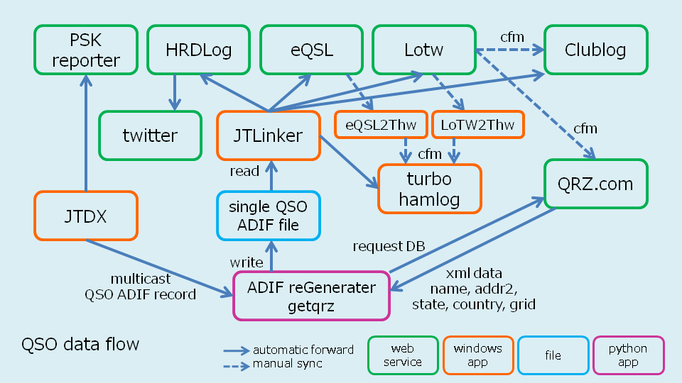
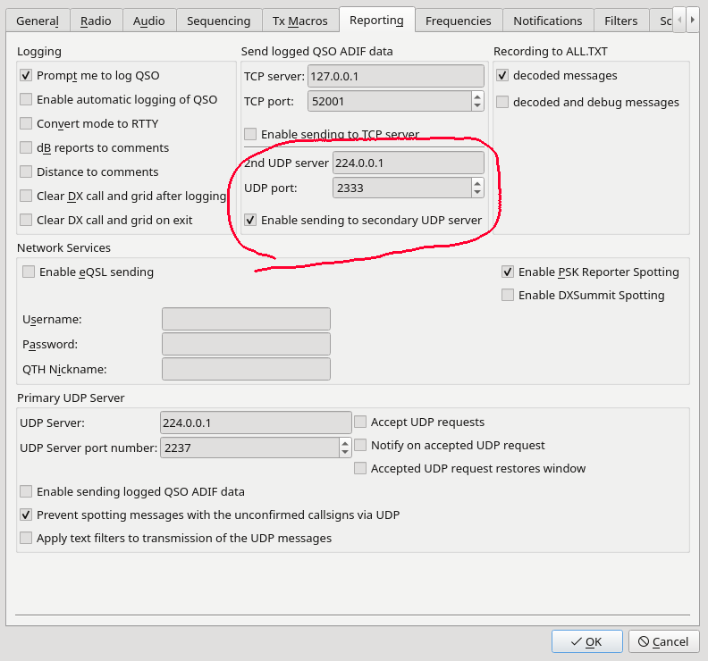

# getqrz

This program provides JTLinker with QSO information combining JTDX QSO data and QRZ.com data.

Works with Python 3.5 and above.

## Overview
The following figure shows the overall view.
getqrz captures JTDX QSO information sent by multicast.
Search QRZ.com DB by callsign and add name, addr2, state and country from QRZ.com to JTDX QSO information.Write it to a file in ADIF format.
JTLinker reads the updated file and transfers the QSO information to the specified web service or logging software.

## Install
Prepare a folder and extract adif.py, rcv_mc.py and getqrz.py

## Execution
Open a terminal and run with  
% ./getqrz.py

## Settings
Set the following parameters to getqrz.py

- username
  QRZ.com user name

- pw
  QRZ.com password

- filename`
  Path and file name "log.adi" specified in "File Path of log.adi (JTAlert) " in JTLinker Decoder settings.
  if the Decoder setting is "Y:\user\", make it "Y:¥user\log.adi"

- size_qth
  QTH digits of Turbo Hamlog

- JTDX reporting settings
  - Set 2nd UDP server to "224.0.0.1"
  - Set UDP port to "2333"
  - Check "Enable sending to secondary UDP server"

`Please refer to the pictures below.`
***
`getqrz.py parameter settings`

***
`JTLinker Decoder setting`

***
`QTH digits setting of Turbo Hamlog`

***
`JTDX reporting settings`

***
